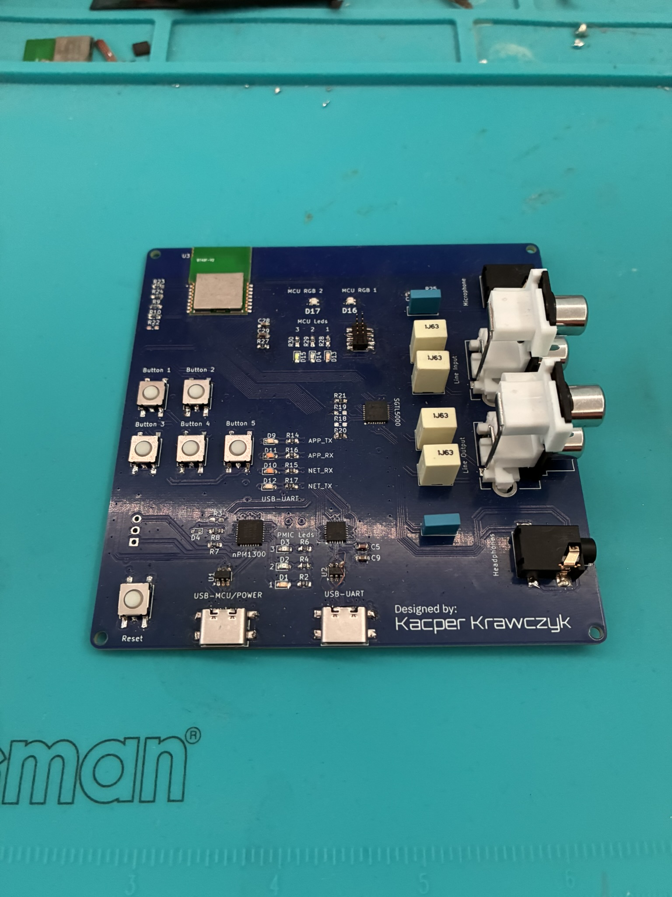
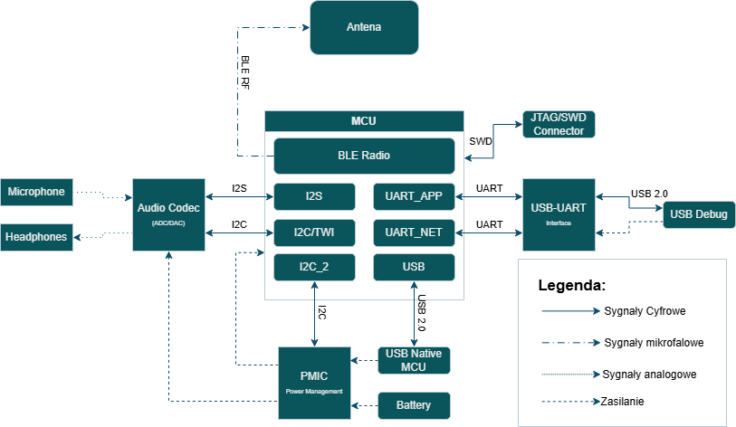
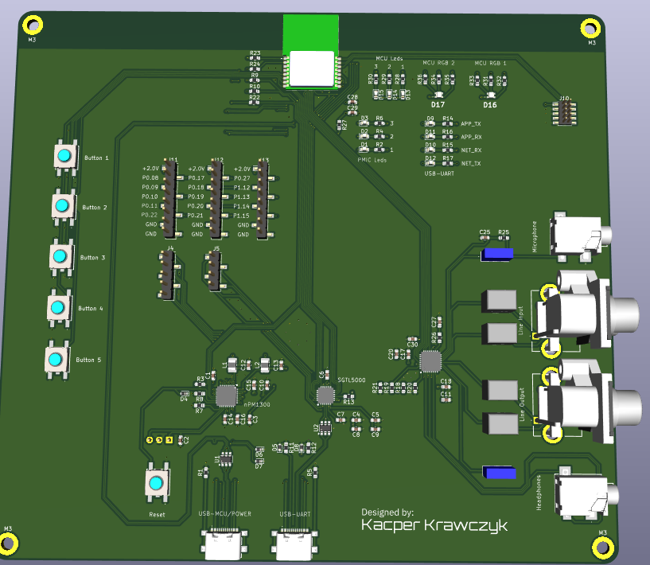

# BLE Audio Platform - Engineering Project



Custom hardware and firmware platform for prototyping and evaluating Bluetooth Low Energy Audio broadcast transmission.

This repository combines:
- custom PCB design created in KiCad
- firmware applications based on nRF Connect SDK and Zephyr RTOS
- component datasheets used during design and bring-up
- test logs and recorded audio collected during BLE Audio experiments

The platform is built around the BT40F SiP with the Nordic nRF5340 and was used to evaluate LE Audio broadcast transmission based on BIS streams.

## System Overview



Main hardware blocks:
- BT40F SiP with Nordic nRF5340
- Nordic nPM13xx PMIC (nPM1304 used in the assembled board as a practical substitute for nPM1300; the main functional difference is reduced battery-charging capability)
- CP2105 USB-UART bridge
- SGTL5000 external audio codec
- USB-C power and debug connectivity
- microphone, line output, and headphone audio connectors

## Repository Layout

```text
.
|-- Datasheets/   Component datasheets used during design and bring-up
|-- Firmware/     Zephyr/NCS applications, overlays, and helper modules
|-- Images/       Board photos, PCB renders, and architecture diagrams
|-- KiCad/        Schematic, PCB, project libraries, and Gerber outputs
`-- Tests_data/   Recorded audio samples and test logs
```

Important subdirectories:
- `Firmware/bap_broadcast_source/` BLE Audio broadcast source application
- `Firmware/bap_broadcast_sink/` BLE Audio broadcast sink application
- `Firmware/codec_test/` codec bring-up and audio-path verification
- `Firmware/test_i2c/` I2C and peripheral detection tests
- `Firmware/leds_test/` PMIC and LED bring-up
- `Firmware/beacon/` BLE beacon baseline application
- `Firmware/biblioteki/` shared helper modules such as `pmic` and `i2c_helpers`
- `KiCad/BT40F_audio_board_smaller/` main KiCad project
- `KiCad/Gerber/` exported manufacturing files
- `Tests_data/Test_Logs/` logs from lab and real-world experiments
- `Tests_data/Recorded_Audio/` captured audio files used during evaluation

Note: some directories inside `Firmware/` such as `build/`, `Build_V1/`, and `MyBoard/` are generated build outputs committed alongside the source tree. They are useful as build records, but they are not the primary source files to edit.

## Firmware Summary

The main project flow is built around two applications:
- `bap_broadcast_source` transmits BLE Audio broadcast streams
- `bap_broadcast_sink` receives BLE Audio broadcasts and contains project-specific modules for LC3 handling, USB, codec output, and stream reception

Additional applications are included for hardware validation and bring-up:
- `codec_test` initializes and probes the SGTL5000 path
- `test_i2c` verifies low-level I2C communication and peripheral presence
- `leds_test` validates PMIC-related control paths and LED behavior
- `beacon` provides a minimal BLE reference application

The per-application `README.rst` files under `Firmware/` are based on upstream Zephyr samples. For this repository, the project-specific behavior is defined mainly by the local `src/`, `boards/`, `*.overlay`, `prj.conf`, and `Kconfig*` files.

## Hardware Design

The hardware project contains:
- schematic and PCB layout files in `KiCad/BT40F_audio_board_smaller/`
- custom symbol and footprint libraries in `KiCad/BT40F_audio_board_smaller/Project libraries/`
- generated Gerbers in `KiCad/Gerber/BT40F_board_revA.zip`
- supporting visual assets in `Images/`

Some hardware files and library names still refer to `nPM1300`, while the assembled prototype used `nPM1304` because `nPM1300` was unavailable at the time. For this project, the devices are treated as near-equivalent except for the weaker charging capability of `nPM1304`.



## Building The Firmware

This repository does not include a full NCS workspace manifest, so builds are expected to run inside an existing nRF Connect SDK environment with `west` available.

Example commands reconstructed from the committed build artifacts:

```bash
west build --pristine --build-dir build/source-custom Firmware/bap_broadcast_source --board nrf5340_audio_dk/nrf5340/cpuapp -- -DEXTRA_CONF_FILE=boards/nrf5340_audio_dk_nrf5340_cpuapp.conf -DCONF_FILE=prj.conf -DEXTRA_DTC_OVERLAY_FILE=Custom_Board.overlay -DDTC_OVERLAY_FILE=app.overlay

west build --pristine --build-dir build/sink-custom Firmware/bap_broadcast_sink --board nrf5340_audio_dk/nrf5340/cpuapp -- -DEXTRA_CONF_FILE=boards/nrf5340_audio_dk_nrf5340_cpuapp.conf -DCONF_FILE=prj.conf -DEXTRA_DTC_OVERLAY_FILE=Custom_Board.overlay -DDTC_OVERLAY_FILE=app.overlay

west build --pristine --build-dir build/codec-test Firmware/codec_test --board nrf5340_audio_dk/nrf5340/cpuapp -- -DCONF_FILE=prj.conf -DDTC_OVERLAY_FILE=nrf5340_audio_dk_nrf5340_cpuapp.overlay
```

If you build one of the custom configurations, review the local overlays and board configuration files in the target application directory before flashing.

## Test Data

Test artifacts are grouped under `Tests_data/`:
- `Test_Logs/01_Lab_Tests/` source and sink logs captured in laboratory conditions
- `Test_Logs/02_Real_World_Tests/` logs collected in a more challenging radio environment
- `Test_Logs/03_Audio_Transmission_test/` dedicated source and sink logs for audio transmission checks
- `Recorded_Audio/` sample WAV captures

Due to memory constraints, logging on the Network Core was disabled. The provided logs come from the Application Core.

## Known Limitations

- The SGTL5000 codec could not be fully used in the final tests because the available MCU clocking was insufficient for the intended MCLK configuration
- Network Core logging was disabled because of memory constraints
- Final validation therefore focused on LC3 processing and BLE transmission rather than a fully closed audio path

## License

This project is licensed under the terms of the [LICENSE](LICENSE) file in this repository.
